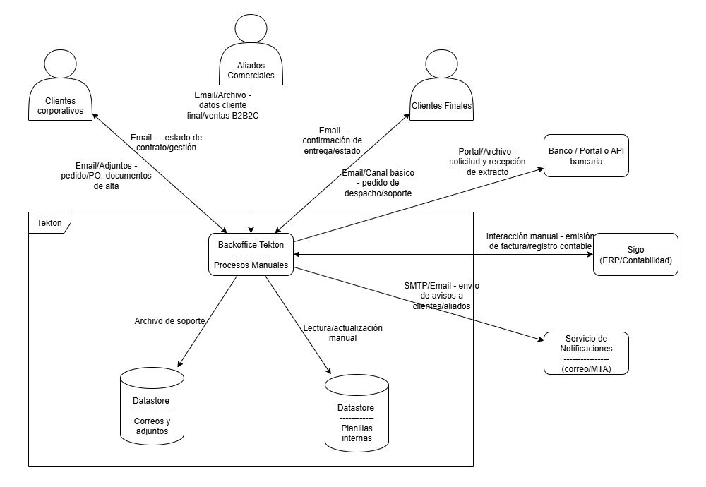

## 🔖 Nombre del Taller
_Taller 3 - Arquitectura Actual del Sistema con el Modelo C4_

## 👥 Integrantes del equipo
- Diego Ramírez - diegorate@unisabana.edu.co  
- Carlos Sánchez - carlossanlo@unisabana.edu.co
- Mateo Vanegas - mateovaco@unisabana.edu.co

## 🧠 Descripción general del trabajo
Este documento presenta la modelación y el análisis de la **arquitectura actual** del sistema de **Tekton Technologies** usando las vistas C1 (Contexto) y C2 (Contenedores) del C4 Model. El trabajo consistió en mapear actores internos y externos, documentar flujos de información críticos, identificar contenedores tecnológicos actuales (Backoffice y datastores) y evaluar debilidades operativas y riesgos asociados al elevado uso de procesos manuales. El objetivo final es entregar una base técnica para priorizar mejoras orientadas a automatización, trazabilidad y escalabilidad.

## 🔧 Proceso de desarrollo
1. **Revisión de artefactos:** Se analizaron los diagramas C1 y C2 aportados por el cliente (versiones de clase y real) para extraer actores, eventos y canales de comunicación.  
2. **Modelado incremental:** Se trazó la vista de contexto (C1) para identificar límites del sistema y actores (Cliente corporativo, Cliente final, Aliado comercial, Áreas internas, Gerente). Posteriormente se detalló la vista de contenedores (C2) centrada en el Backoffice Tekton y sus repositorios de soporte (correos/adjuntos y planillas internas).  
3. **Inventario de flujos y datos:** Se documentaron los flujos críticos (alta clientes, pedidos, registro de entregas, reportes KPI, conciliación contable) y los medios usados (email, portales, SMTP, interacciones manuales con ERP).  
4. **Análisis de riesgos y recomendaciones:** Se identificaron debilidades técnicas y operativas y se priorizaron recomendaciones (quick wins, mediano y largo plazo), considerando impacto y esfuerzo.  
5. **Validación y cierre:** Se consolidó el informe técnico y la lista de entregables para el repositorio.

Herramientas: **draw.io** para diagramas y Markdown para documentación colaborativa.

## 🧩 Análisis del modelo propuesto
### Cómo se estructura el modelo entregado
- **C1 (Contexto):** Tekton aparece como el sistema central que recibe y envía información hacia/desde clientes corporativos y finales, aliados comerciales y áreas internas. Describe claramente los límites del sistema y los puntos de interacción externos (bancos, ERP, servicios de notificaciones).  
- **C2 (Contenedores):** El núcleo es el *Backoffice Tekton* (sistema central con procesos mayoritariamente manuales). Lo acompañan dos datastores principales: uno para correos y adjuntos y otro para planillas internas. También se identifican integraciones con Sigo (ERP/Contabilidad), portales bancarios y un servicio de notificaciones (MTA/SMTP).

### Cómo representa las necesidades del cliente
- El modelo refleja las necesidades operativas de Tekton: **gestión de contratos y altas de cliente**, **recepción y despacho de pedidos**, **registro de entregas** y **generación de reportes KPI** para gerencia.  
- También deja en evidencia la dependencia de procesos manuales que afectan tiempos de respuesta, trazabilidad y capacidad de escalar operaciones sin errores.

### Supuestos tomados
- Las integraciones con ERP y bancos son mayoritariamente manuales o vía portal (no API nativa).  
- El Backoffice es un sistema centralizado (monolítico o modularidad limitada) con ausencia de un bus de integración o event broker robusto.  
- El almacenamiento de documentos es no estructurado (correo/adjuntos y planillas Excel/CSV) y carece de metadatos estandarizados.

## 📈 Diagrama final entregado

- `entrega/c1-contexto-final.jpg` — Diagrama C1 (Contexto) Tekton.  
- `entrega/c2-contenedores-final.jpg` — Diagrama C2 (Contenedores) Tekton.  

## 📋 Tabla de actores, entidades o componentes (si aplica)

| Nombre del elemento   | Tipo         | Descripción | Responsable |
|-----------------------|--------------|-------------|-------------|
| Cliente corporativo   | Actor        | Empresa que solicita servicio y envía PO/documentación | Comercial |
| Cliente final         | Actor        | Usuario final que solicita despachos y confirma entregas | Operaciones |
| Aliado comercial      | Actor        | Partner que envía datos de clientes finales y recibe estados | Alianzas |
| Área administrativa   | Interno      | Gestiona altas de cliente, contratos y datos de facturación | Administración |
| Área de operaciones   | Interno      | Registra entregas y gestiona pendientes logísticos | Operaciones |
| Gerente               | Stakeholder  | Consume reportes KPI y toma decisiones estratégicas | Dirección |
| Backoffice Tekton     | Contenedor   | Aplicación central con procesos y reglas de negocio (alto grado manual) | TI/Operaciones |
| Datastore - Correos   | Contenedor   | Almacenamiento de correos y adjuntos (no estructurado) | TI |
| Datastore - Planillas | Contenedor   | Planillas internas (Excel/CSV) usadas para operación | TI/Operaciones |
| Sigo (ERP/Contab.)    | Sistema ext. | Sistema contable para emisión de facturas y registros | Contabilidad / Tercero |
| Servicio de Notif.    | Sistema ext. | MTA/SMTP para envío de avisos a clientes y aliados | Proveedor |
| Banco / Portal API    | Sistema ext. | Portal o API bancaria para conciliación/extractos | Finanzas / Banco |

## 🔍 Investigación complementaria
### Tema investigado:
Automatización de Backoffice e integración API-first en organizaciones B2B.

### Resumen:
La investigación se centró en patrones de integración y estrategias de modernización aplicables a empresas que dependen aún de procesos manuales. Dos enfoques recurrentes son (1) **API-first**, que obliga a definir contratos claros y versionables entre sistemas, permitiendo a clientes y aliados integrarse de forma controlada; y (2) **desacoplamiento mediante mensajería asíncrona** (colas o event streaming) para procesar pedidos, notificaciones y conciliaciones sin bloquear flujos operativos. Estos patrones reducen dependencia de intervención manual, mejoran trazabilidad y permiten escalar procesamiento en horas pico.

Además, la evidencia práctica indica que una migración progresiva —comenzando por exponer APIs críticas (alta de cliente, creación de pedido, confirmación de entrega) y estructurar el almacenamiento de documentos— genera beneficios tempranos. Paralelamente, se recomienda construir pipelines ETL/ELT para alimentar un datawarehouse que soporte dashboards KPI, y diseñar adaptadores para ERP que eliminen la necesidad de conciliaciones manuales.

## 📚 Referencias
- [1] Brown, Simon. *The C4 Model for Software Architecture*. 2019. https://c4model.com/  
- [2] Hohpe, Gregor & Woolf, Bobby. *Enterprise Integration Patterns*. 2003.  
- [3] ThoughtWorks. *Tech Radar* — prácticas de integración y observabilidad.  
- [4] Material sobre API-first y OpenAPI (documentación y guías prácticas).

---

_Este documento hace parte de la entrega del taller 3 del curso AREM (Arquitectura Empresarial) - Universidad de La Sabana._
